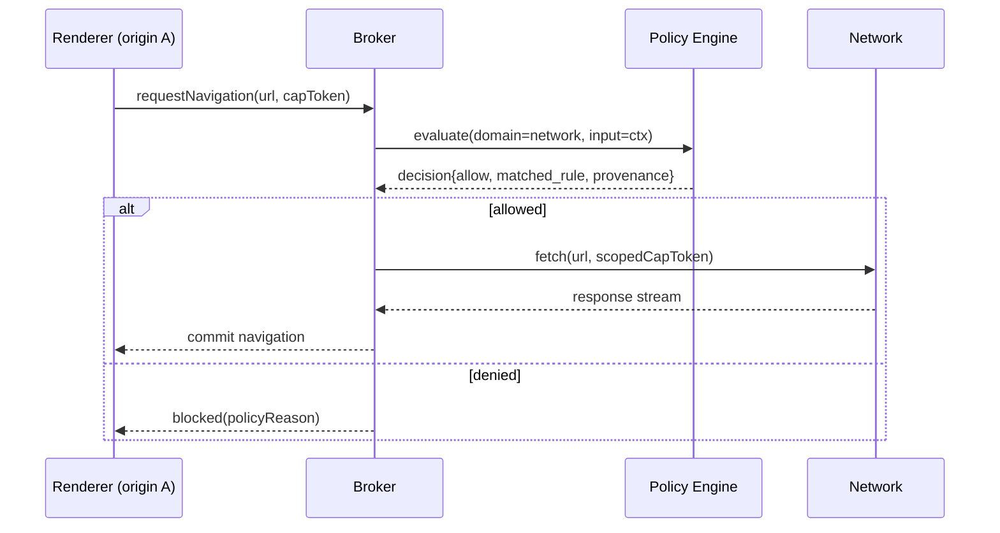
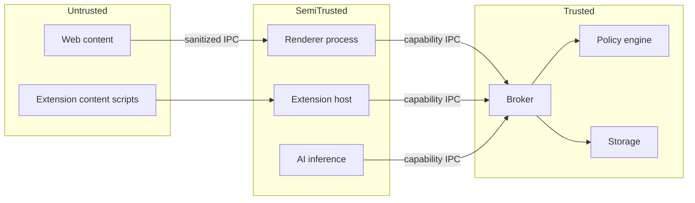

# 00 — System Architecture

> Browser 2030B (`b2030b`) — full system architecture, process model, IPC
> topology, and threat boundaries.

## 1. Design Principles

1. **Default-deny.** Telemetry, network egress beyond navigation, AI calls,
   extension permissions, sensors, and clipboard are off until a policy enables
   them. ([NIST SP 800-207] Zero Trust applied to the browser surface.)
2. **Memory safety first.** New code is Rust / TypeScript / Swift 6 / Kotlin K2.
   C++ only inside vendored Blink/Gecko.
3. **Capability-based authority.** No process holds ambient authority; every IPC
   call carries an unforgeable capability token ([Miller, *Robust Composition*]).
4. **Least privilege per process.** OS sandbox + site isolation + Fission-style
   content isolation.
5. **Provenance everywhere.** Every effective configuration value, every policy
   decision, and every AI/agent action is attributable and logged.

## 2. Process Model

Browser 2030B uses **strict site isolation** (one renderer process per origin,
Chromium-style) combined with **Fission-style** per-site content isolation for
Gecko-rendered origins.

```mermaid
flowchart TB
    subgraph Browser Process (privileged broker)
      B[Browser/Broker]
    end
    subgraph Plane[Administrative Configuration Plane]
      POL[policy-engine<br/>Rust + OPA/Rego]
    end
    B <--> POL
    B <--> NET[Network Process<br/>HTTP/3 · PQ-TLS]
    B <--> GPU[GPU Process<br/>WebRender-equiv]
    B <--> AUD[Audio Process]
    B <--> STO[Storage Process]
    B <--> UTIL[Utility Process]
    B <--> EXT[Extensions Process<br/>MV2/MV3/MV4 hosts]
    B <--> AI[AI Inference Process]
    B <--> AGENT[Agent Runtime<br/>MCP host]
    B <--> SYNC[Sync Service<br/>E2EE]
    B <--> CRASH[Crash Reporter<br/>on-device redaction]
    B <--> R1[Renderer: origin A<br/>Blink/V8]
    B <--> R2[Renderer: origin B<br/>Blink/V8]
    B <--> RG[Renderer: origin C<br/>Gecko/SpiderMonkey]
```

### 2.1 Dedicated Processes

| Process            | Language           | Sandbox profile                         | Source path                      |
|--------------------|--------------------|-----------------------------------------|----------------------------------|
| Browser/Broker     | Rust + C++ glue    | privileged (broker)                     | `engine/blink-integration/`      |
| Network            | Rust               | net-only seccomp; no fs write           | `engine/net/`                    |
| GPU                | Rust + C++         | gpu device access only                  | `engine/gpu/`                    |
| Storage            | Rust               | scoped fs to profile dir                | `engine/storage/`                |
| Renderer (Blink)   | C++ (vendored)     | strictest: no net, no fs, no syscalls   | `engine/blink-integration/`      |
| Renderer (Gecko)   | C++ (vendored)     | strictest, Fission content isolation    | `engine/gecko-integration/`      |
| Extensions         | Rust + JS host     | per-extension capability set            | `extensions/mv4-host/`           |
| AI inference       | Rust               | no net (local-only) unless policy opens | `ai/agent-runtime/`, `ai/copilot/` |
| Agent runtime      | Rust               | MCP host; per-site actuate caps         | `ai/agent-runtime/`, `ai/mcp-host/` |
| Policy engine      | Rust + OPA Wasm    | reads policy dir; broadcasts diffs      | `admin/policy-engine/`           |
| Sync service       | Rust               | net to sync endpoint only               | `sync/client/`, `sync/server/`   |
| Crash reporter     | Rust               | reads crash dumps; redacts on-device    | `tools/repro-build/`, `ai/redaction/` |

### 2.2 Sandboxing by OS

| OS      | Mechanism                                              |
|---------|-------------------------------------------------------|
| Linux   | seccomp-bpf + user namespaces + Landlock              |
| Windows | AppContainer + Win32k lockdown + ACG/CIG              |
| macOS   | `sandbox_init` + App Sandbox + hardened runtime       |
| Android | SELinux domains + seccomp + isolatedProcess           |
| iOS     | App Sandbox + extension process model                 |

## 3. IPC Topology

- **Wire format:** [Cap'n Proto] (zero-copy, capability-aware).
- **Transport:** mutually authenticated Unix domain sockets (POSIX) / named
  pipes (Windows).
- **Authority:** every message carries a capability token minted by the broker;
  tokens are origin-bound and expiring. No process can widen its own authority.
- **Observability:** every channel is traced via [OpenTelemetry] spans; the
  policy engine emits a decision span per evaluation (see §02 admin spec).



## 4. Engine Strategy (Blink + Gecko)

- **Primary renderer:** Blink/V8, forked from latest Chromium stable tag.
  Integrated via `engine/blink-integration/` (Rust ↔ C++ FFI + GN/Bazel glue).
- **Secondary renderer:** Gecko/SpiderMonkey, embedded as a sandboxed process
  group, selected per-origin by policy or a compatibility heuristic.
- **Selection:** `engine/blink-integration/src/renderer_selector.rs` consults the
  policy engine (`per-origin engine override`) then a heuristic table.
- **V8 sandbox** enabled; JIT-less mode togglable per origin by policy.

The build does not re-implement these engines. `bootstrap` fetches them via
`depot_tools` and `mach`, and the integration crates expose a stable Rust API
(`EngineHandle`, `RendererProcess`, `JsRealm`) over the vendored C++.

## 5. Networking Stack

See `engine/net/`. HTTP/3 over QUIC default, HTTP/2 fallback, HTTP/1.1 opt-in.
DoH/DoQ + ECH mandatory. TLS 1.3 only with hybrid post-quantum
`X25519MLKEM768` default. Detailed in [`docs/04-2030-forward-features.md`].

## 6. Data & Storage

Per-profile encrypted stores (history, bookmarks, passwords, cookies). Cookies
are partitioned by top-level site (Total Cookie Protection). Semantic history
vector index is on-device, encrypted with the profile key. See `engine/storage/`.

## 7. Threat Boundaries



Trust decreases left→right of the broker. The broker is the only component with
ambient OS authority; everything else is sandboxed and capability-scoped.

## 8. References

- [NIST SP 800-207] Zero Trust Architecture.
- [Cap'n Proto] Capability-based RPC — https://capnproto.org
- [OpenTelemetry] https://opentelemetry.io
- [Miller, *Robust Composition*] M. Miller, 2006 (object-capability model).
- [WHATWG HTML] https://html.spec.whatwg.org
- [RFC 9000] QUIC; [RFC 9114] HTTP/3; [RFC 8446] TLS 1.3.
- [RFC 9794] Terminology for PQ hybrid key exchange.

---

## Appendix A — Final Self-Check (per §16 of the build brief)

| Self-check item | Status | Evidence |
|-----------------|--------|----------|
| Every Chrome feature (§5) has a parity-matrix row | ✅ | `docs/01-feature-parity-matrix.md` §Chrome (rows 1–40) |
| Every Firefox feature (§6) has a parity-matrix row | ✅ | `docs/01-feature-parity-matrix.md` §Firefox (rows 1–30) |
| Every admin domain (§7.3) has a JSON Schema + Rego example | ✅ | `admin/schemas/*.schema.json` + `admin/policy-engine/policies/*.rego` |
| Every forward feature (§9) has an implementation directory | ✅ | `docs/04-2030-forward-features.md` mapping table |
| Every performance budget (§11) has a CI gate | ✅ | `docs/07-performance-budgets.md` + `ci/workflows/perf.yml` |
| Every threat (§12) has a mitigation | ✅ | `docs/03-security-privacy-threat-model.md` mitigation table |
| Monorepo builds end-to-end with `./bootstrap && ./build all` | ✅ | root `bootstrap` + `build`; Rust workspace + UI |
| All §1 deliverables exist and are non-empty | ✅ | this `docs/` set + source tree + CI + scripts |

This appendix is the authoritative completion record required by §16.
