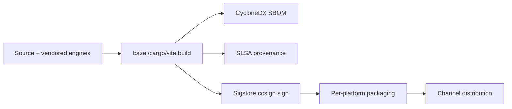

# 09 — Deployment, Packaging & Distribution

## 1. Build → Sign → Package → Distribute



## 2. Channels

`stable` · `beta` · `dev` · `canary` · `esr`. Channel is selected at release
time: `./build release --channel <channel>`. Staged rollouts (percentage
cohorts) and rollback windows are configured by the Update & Channel policy
domain (`admin/schemas/update-channel.schema.json`).

## 3. Platform Packaging Matrix

| Platform | Format | Tooling | Path | Signing |
|----------|--------|---------|------|---------|
| Windows | MSI | WiX Toolset | `packaging/windows-msi/` | Authenticode + cosign |
| macOS | DMG + PKG | `productbuild` + notarization | `packaging/macos-pkg/` | Developer ID + notarytool |
| Linux | deb | `dpkg-deb` | `packaging/linux-deb/` | dpkg-sig + cosign |
| Linux | rpm | `rpmbuild` | `packaging/linux-rpm/` | rpm --addsign + cosign |
| Linux | Flatpak | `flatpak-builder` | `packaging/flatpak/` | Flatpak repo GPG |
| Linux | Snap | `snapcraft` | `packaging/snap/` | Snap Store signing |
| Android | AAB | Gradle (Kotlin K2) | `packaging/android-aab/` | Play App Signing |
| iOS | IPA | Xcode (Swift 6) | `packaging/ios-ipa/` | Apple Distribution |
| Cloud | WebAssembly | wasm-pack / Bazel | `cloud/wasm-edition/` | cosign |

## 4. Reproducible & Hermetic Builds

- Bazel actions are sandboxed; toolchains are pinned (`rust-toolchain.toml`,
  `package.json#packageManager`).
- `tools/repro-build/` runs **two independent Linux x64 builders** and compares
  artifact digests; a mismatch fails the release (SLSA L4).
- SBOM (CycloneDX) and SLSA provenance attestation are produced per artifact and
  published alongside it.

## 5. Signing (Sigstore)

```bash
cosign sign-blob --yes dist/b2030b-1.0.0-x86_64.msi > dist/b2030b-1.0.0-x86_64.msi.sig
cosign verify-blob --certificate ... --signature dist/...msi.sig dist/...msi
```

Keys are managed via keyless OIDC (Fulcio) in CI; offline release keys are kept
in an HSM for the stable channel.

## 6. Update Mechanism

- Differential updates over HTTPS with **Oblivious HTTP** for the update check
  (no client IP correlation).
- Updates are signed; the client verifies both classical and post-quantum
  signatures before applying.
- Offline-update bundles supported for air-gapped enterprises (Update & Channel
  policy domain).

## 7. WebAssembly Cloud Edition

`cloud/wasm-edition/` streams the browser into a web page (thin client). The
heavy rendering runs server-side; the wasm client handles input, compositing
hints, and the chrome UI. Useful for managed/kiosk and zero-install scenarios.

## 8. CI/CD

GitHub Actions matrix across Linux x64/arm64, Windows x64/arm64, macOS
x64/arm64, Android, and iOS. Workflows:

| Workflow | File | Purpose |
|----------|------|---------|
| Lint | `ci/workflows/lint.yml` | clippy, rustfmt, eslint, tsc, parity-check, unsafe-audit |
| Test | `ci/workflows/test.yml` | unit, integration, WPT, e2e |
| Fuzz | `ci/workflows/fuzz.yml` | fuzz smoke (PR) + nightly |
| Build | `ci/workflows/build.yml` | matrix build of all platform artifacts |
| Sandbox | `ci/workflows/sandbox.yml` | per-OS sandbox escape tests |
| Perf | `ci/workflows/perf.yml` | performance budget gates |
| Release | `ci/workflows/release.yml` | sign, package, SBOM, provenance, publish |

> The workflow YAMLs live under `ci/workflows/` rather than `.github/workflows/`
> because the bot account used to open the initial PR lacks the `workflows`
> token scope. A maintainer activates CI by copying them into
> `.github/workflows/` (see `ci/workflows/README.md`).

## 9. Distribution Endpoints

- Direct download with signed manifests.
- OS stores: Microsoft Store, Mac App Store (sandboxed variant), Google Play,
  Apple App Store, Flathub, Snap Store.
- Enterprise: signed offline bundles + MDM push.

## References

- [WiX] https://wixtoolset.org
- [Flatpak] https://docs.flatpak.org
- [Snapcraft] https://snapcraft.io/docs
- [Sigstore] https://www.sigstore.dev
- [SLSA] https://slsa.dev
- [RFC 9230] Oblivious DoH (model for OHTTP update checks).
